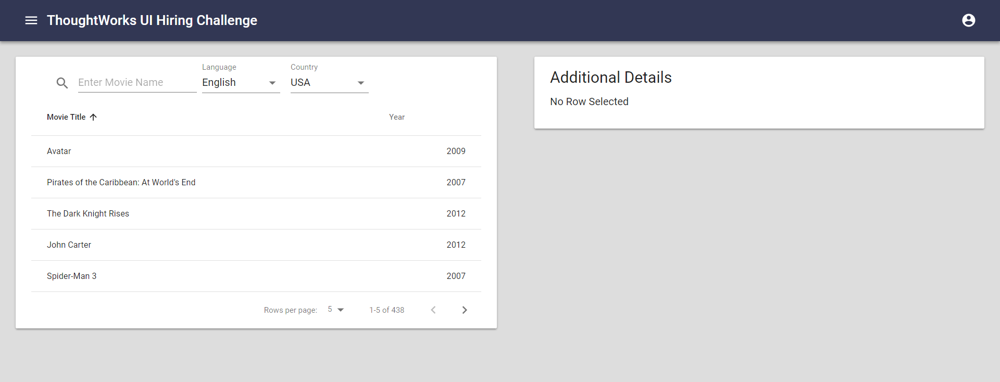
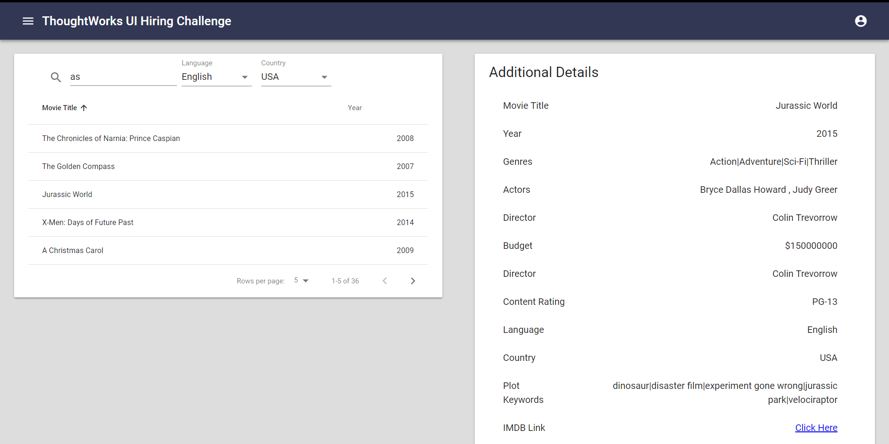
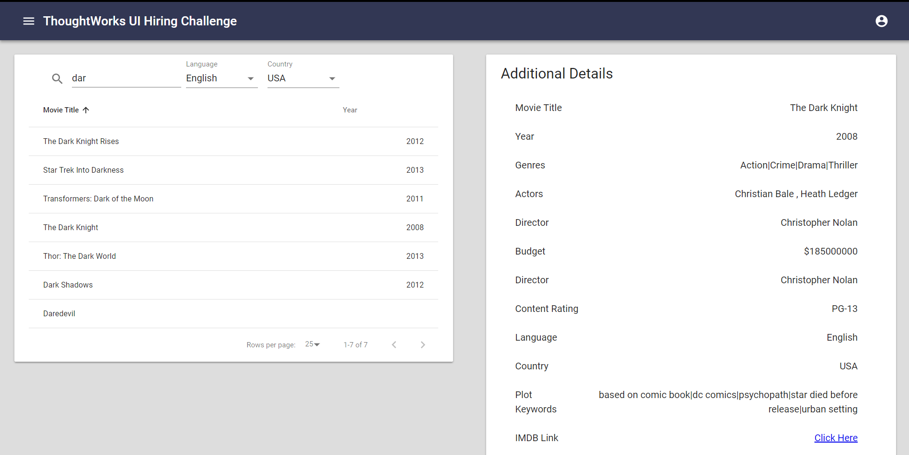
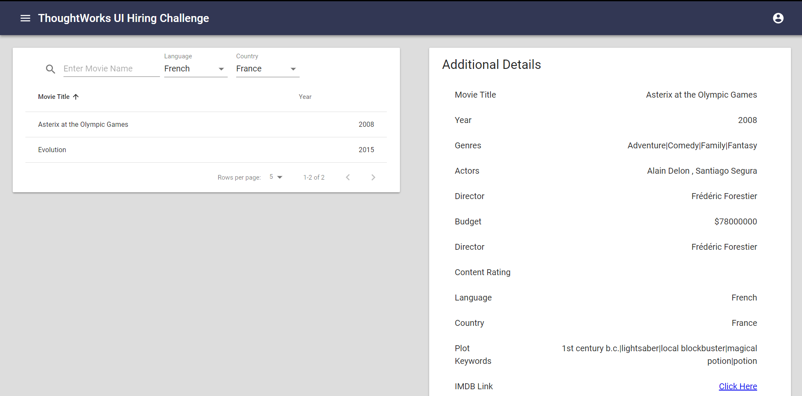
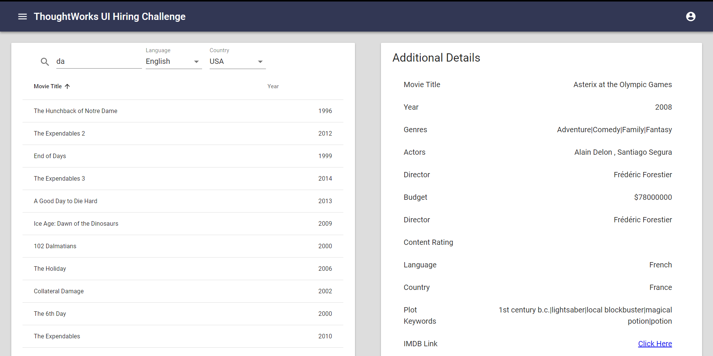
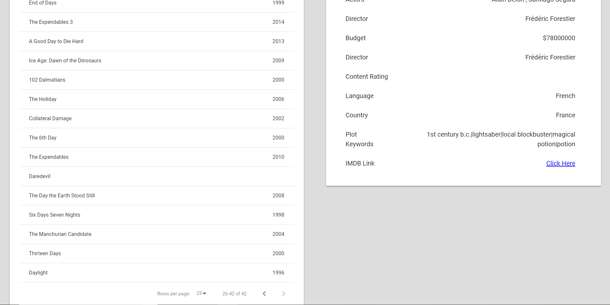

## Quick Overview

Make sure to have nodejs > 8 installed

```sh
cd ThoughtWorks
npm install
npm start
```

This starts up the app and can be viewed on http://localhost:3000/ 

Initial Screen:

<p align='center'>

</p>


## Brief Explanation of Code

* This application is setup with reactjs and themed in react material UI
* The layout of page is mainly setup in src/components/Home.js on default route
* The header Component provides the title of the application
* The Left Area displays table of fetched data
* The right area displays additional information of selected Table Row
* The data is fetched from server with fetch API and initial state and data of application is then set
* Now the data is loaded into the table component and left area is set with inital data
* Clicking on Any table row, the additional table information can be viewed on the right
  <p align='center'>

</p>

* To search any Movie title, Use the searchbox to filter table results
<p align='center'>

</p>

* Use select boxes to filter results by Language or Country
  <p align='center'>

</p>

* The table is paginated and by default 5 rows are displayed per page and this can be increased 
  <p align='center'>

</p>

* Use left and right icons of table to naviagte across pages 
 <p align='center'>

</p>
